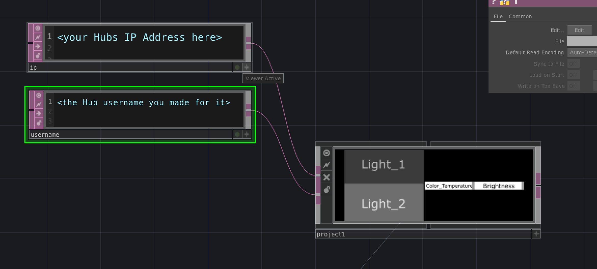

# TD Hue

## How to use
The Phillips hue API (v1) can be used with a series of http requests. This has been built out with Touchdesigner. This tutorial assumes you have somewhat of a working knowledge of Touchdesigner.

### Needed Info

- Hub IP - You will need your Hue Hub ip address for this. I use a tool like [Lanscan](https://www.iwaxx.com/lanscan/) to find it.
- Your username - This is something you will create when setting up your hub app for the first time. For better in depth instructions here look at [this link](https://developers.meethue.com/develop/get-started-2/)

### How to use

Change those values in the top most level of your file.

Assuming your light ids are lights 1 and 2 you can go ahead and control your color temperature and brightness from the panel on the right.